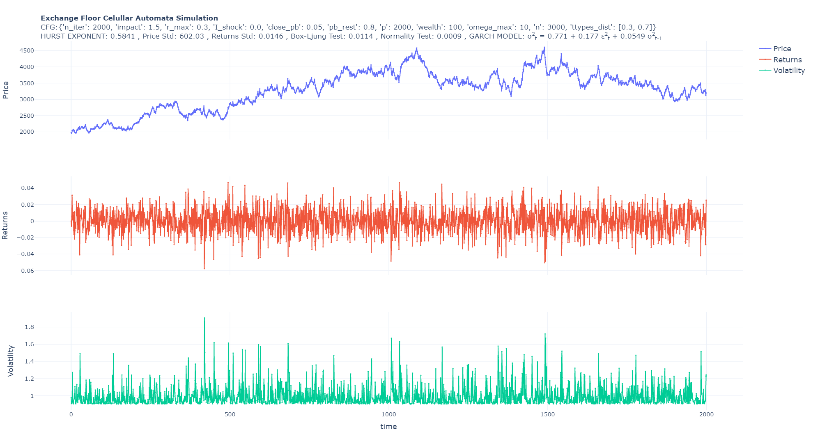

## Introduction
This work presents a cellular automata model that mimics the dynamics of a market exchange from which price fluctuations can be explained. Stock markets are complex systems and in empirical sciences, they can be model as the interactions of homogeneous agents. The impact of microlevel agents behaviors causes a macrolevel system output (price fluctuation) that can be analyzed. The purpose of this work is to generate artificial financial time series that exhibit the same styled facts that we observed in real financial instruments.

The model in this work is an adaptation of the Hernandez's (2015) work and considers the concepts of collective behaviour stated by Couzin et al. (2005) and the market sentiment presented by Shiller (2000). This means that traders buy and sell influenced by their neighborhood and by sentiment. The traders are represented as cells in a m x m board and a price series emerges as result of a complex system interaction between the investors.

* Couzin, I.D., Krause, J., Franks, N.R., Levin, S.A., 2005. Effective leadership and decision-making in animal groups on the move. Nature 433, 513–516. URL: https://www.nature.com/articles/nature03236, doi:10.1038/nature03236.
* Hernandez, P.F., 2015. Financial time series obtained by agent-based simulation. Ph.D. thesis. Universitat de Barcelona
* Shiller, R., 2000. Measuring bubble expectations and investor confidence RJ Shiller - The Journal of Psychology and Financial Markets, 2000 - Taylor & Francis.pdf.


### Installation

1. Clone the repo
   ```sh
   git clone https://github.com/SamShelby/cellular-automata-financial-market.git
   ```
3. Install requirements
   ```sh
   pip install requirements.txt
   ```
   
<!-- USAGE EXAMPLES -->
## Usage

To run the simulations go to: src/stockmarket/sim 
and run
```sh
   python sim.py
   ```
the simulation results are saved 'results' and the time series plot is saved in 'images'

<a href="https://github.com/SamShelby/cellular-automata-financial-market/blob/main/src/stockmarket/sim/images/sim_rNone_2021_05_14_18-23.png">
    
  </a>
